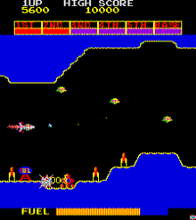
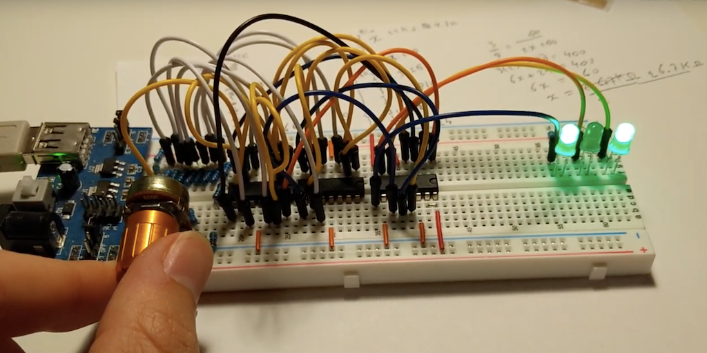
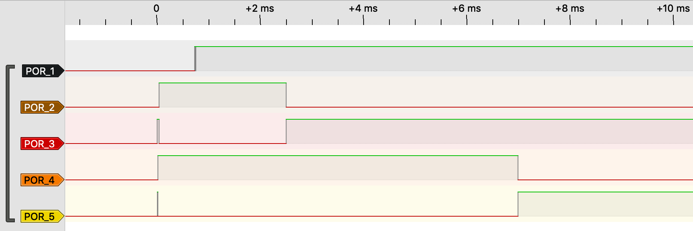
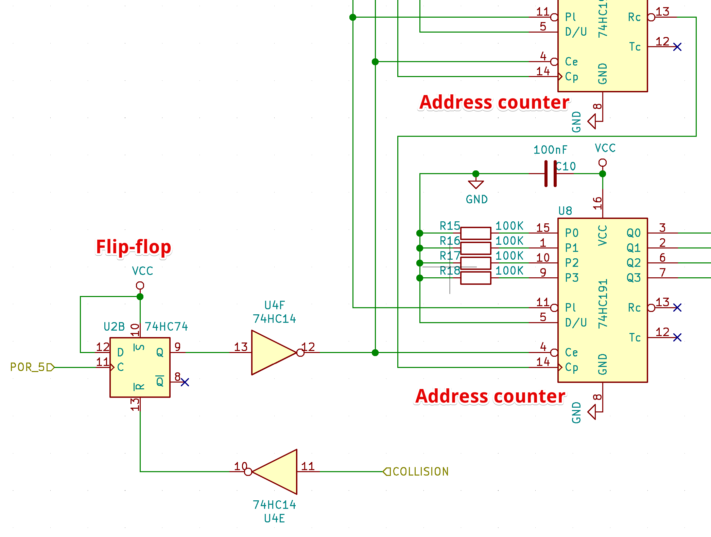
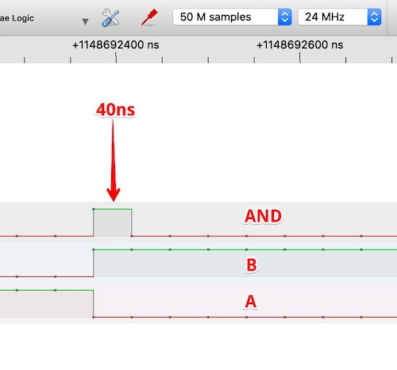
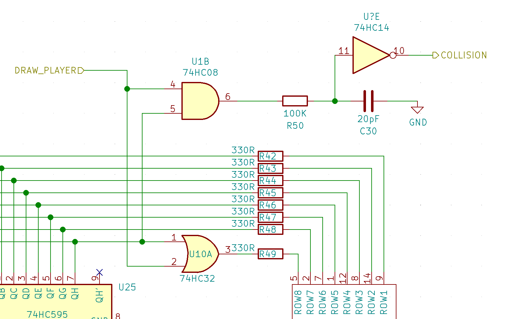
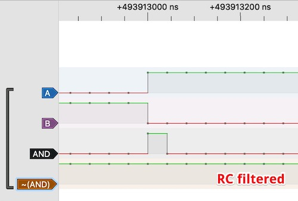
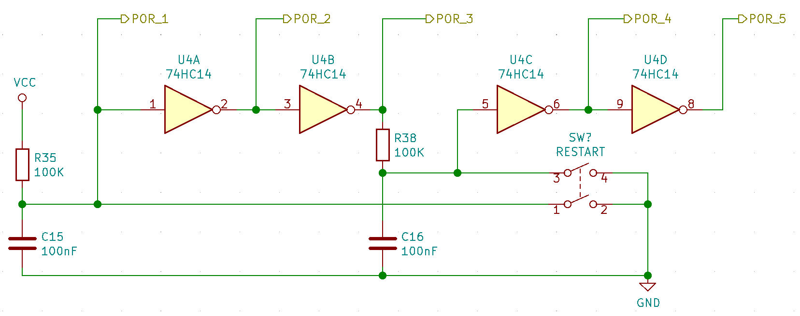

## Scramble: A Simple Scrolling Game

With the [marquee display working](../matrix/matrix.md), I figured it would be
interesting to see if it could be expanded upon with some interactive elements
to turn it into a (very simple!) game.

Could we fly and navigate a pixel through a scrolling field of obstacles in the
style of early games video?

I loved playing [River Raid](https://www.youtube.com/watch?v=pmPjsBDN9Xw) in
the mid 80s which according to [creator Carol
Shaw was inspired](http://www.vintagecomputing.com/index.php/archives/800) by
the 1981 Konami video game
[Scramble](https://en.wikipedia.org/wiki/Scramble_%28video_game%29).

With a heavy dose of imagination, an 8x8 two-color display with a single
interactive pixel for a spaceship might be a bit like the horizontally
scrolling game Scramble?

## No Microcontroller

When tinkering with the [marquee circuit](../matrix/matrix.md), I decided to
avoid using a microcontroller, Arduino or Raspberry Pi and code, but instead
hardwire everything using basic logic ICs. Even though it severely limits the
complexity we can reasonably achieve on a breadboard, it'd be a fun challenge
to continue this artificial restriction.

## Overlay Drawing 

Since the marquee circuit merely displays what's in the shift registers and
can only append to the data, not modify any pixel data already in the latches,
I decided to draw the movable pixel on top of the marquee data, on the
left-most column of the display and let you move it up an down using some
input control.

Your pixel will be at any value between 0-7 on the left-most column and to
paint it on the display, we need to wait until the row that we are on is being
drawn and then light up the last (left) pixel of the row, regardless of the
contents of the shift register at that location. When a row is painted that we
are not on, then the last pixel should just reflect the contents of the
register.

Expanding on the schematic from the [marquee circuit](../matrix/matrix.md), we
can use an OR gate to compare the value of the last bit of the shift
register and whether our pixel is located on the row currently being painted.

This also provides a convenient place for collision detection and the player to
die. If both lines are high, we have a collision, so at this point we're adding
a [74HC08](https://assets.nexperia.com/documents/data-sheet/74HC_HCT08.pdf)
(quad AND gate) and
[74HC32](https://assets.nexperia.com/documents/data-sheet/74HC_HCT32.pdf)
(quad OR gate).

## Input Control

To move the spaceship pixel up an down I decided to use a potentiometer for the
player to turn up and down, instead of push buttons, even though the analog
nature of a pot and lack of microcontroller means more circuitry.

I decided to reuse the [custom Analog to Digital Converter](../opamp.md)
circuit I had built earlier. It uses the pot as a voltage divider and a series
of op amps to compare the voltage to 7 discrete levels. This is then encoded
into a 3-bit binary number indicating the horizontal row the player is on.

As the display scanning and refreshing logic repeatedly cycles up and down the
display, painting each line, the player's 3-bit location is compared to the
display counter. When the player's row is painted, the two 3-bit values will
match and we bring the second line to the OR gate high.

For this comparision we're using a
[74HC688](https://assets.nexperia.com/documents/data-sheet/74HC688.pdf) 8-bit
magnitude comparator (though we only use 3 of its bits).

With this in place, we now have a vertically movable pixel on top of whatever
content scrolls over the display. The circuit even detects when you run into
the environment (although it doesn't respond yet).

## Power On Reset

When an electronic circuit that maintains state, like a
[flip-flop](https://en.wikipedia.org/wiki/Flip-flop_%28electronics%29), is
powered on, it's initial state (on or off) is generally unpredictable. This is
also the case for the storage flip-flops in our shift registers. This means
that on startup the display will be filled with random data which then
gradually scrolls off screen as new data is latched.

This was annoying with the earlier marquee circuit, but is very problematic for
our game as random data might spawn on the player's location, instantly causing
a crash.

To avoid this we need to make sure all shift registers boot up empty and since
the only way to clear a 595 shift register is to bring its `SRCLR` line low and
then clocking its latch input `SRCLK`, we need to build a little multi-step
circuit that runs only on startup.

Not sure how this type of thing is typically done, I decided to add a
resistor-capacitor that starts charging on startup, rising its voltage until it
triggers a
[schmitt-trigger inverter](https://assets.nexperia.com/documents/data-sheet/74HC_HCT14.pdf)
to flip, providing a digital signal delayed by about 2.5 milliseconds after
startup.

By daisy chaining several of these we get 5 output lines that exhibit the
following delayed characteristics:

Note that the voltage on the first line rises gradually instead of sharply,
which is not a digital signal, confusing the logic analyser.

We connect the shift registers' `SRCLR` line to line `POR_5` so we have about
7ms after startup to deliver a pulse to `SRCLK` and clear out the register's
initial random data.

We also connect `POR_5` to the display driver's line decoders' `G1` pins to
disable their outputs during these initial 6ms. This way none of the shift
registers or display cathode drains activate, keeping the display dark.

We AND `POR_3` and `POR_4` to create a single low-high-low pulse from ~2.5 to
~7ms after startup to flush the contents.
This one-time pulse can be OR'd with the regular clock signal driving the shift
registers' `SRCLK` inputs during the marquee cycle.

Lastly we also need to reset the address counters to 0 on startup. The
[74HC191](http://www.ti.com/lit/ds/symlink/sn54hc191.pdf) has a LOAD line (`Pl`
in the schematic) to instantly set the internal state to the values on the 4
input lines P0-P3 on which we use pull-down resistors. The `Pl` pin is
connected to `POR_5`.

## Collisions

The game now starts up cleanly with an empty screen as the parcourse starts
scrolling in from the right and we need a mechanism to freeze the game when you
collide with the environment.

To be able to control the scrolling we add a
[74HC74](https://assets.nexperia.com/documents/data-sheet/74HC_HCT74.pdf)
flip-flop we can toggle between scrolling and stopped. This state can be used
as input on the marquee's address counters' Count Enable `CE` pin.

We want to make sure the flip-flop comes up in counting mode at startup to
start off the game scrolling and so we connect its data input line to VCC and
its clock line to POR_5 so in the event the flip-flop comes up in LOW state,
it will toggle automatically to HIGH at the 7ms mark.

Next we connect the inverted collision signal from earlier to the flip-flop's
reset `R` line. When a collision occurs, `R` will go from HIGH to LOW,
toggling the state to off, bringing the counters' Count Enable `Ce` line HIGH,
stopping all scrolling motion.

## Race Conditions

When testing this collision logic, I kept dying whenever there was a wall
directly below me. This shouldn't happen as I never actually moved into the
row below.

With the logic analyzer connected to the AND gate that compares the draw signal
from the ADC input circuit against the pixel value from shift register of the
active row, an odd signal appeared.

First the player's row gets drawn during which line `A` goes high. This row does
not have scenery on the last pixel, represented by a low signal on the output
line of the shift register `B`. Then the display switches to paint the next
row. At this point the (next) shift register output line goes high, while the
player's row goes low (we're not visible on this line) simultaneously.

There should not be pulse on the AND gate's output, but for ~40ns (the highest
resolution of my 25MHz logic analyzer) the output is high, triggering the game
state flip-flop.

What's actually happening here is that during the row transition the signal
from the shift register arrives slightly ahead of the signal from the ADC (which
traverses a longer path through more ICs) and so for a few nanoseconds, both
AND inputs are high. A literal race condition.

The crude solution I came up with was to put a simple RC low pass filter on the
AND gate's output to suppress pulses shorter than 2 microseconds.

This got rid of the race condition and stabilized the game play. The ghost
pulse still appeared on the AND gate, but didn't propagate through the filter.

## Restarting

To restart the game after it stops, we extend the Power On Reset circuit by
adding a button to discharge the capacitors, re-initiating the conditions at
startup.

That brought the project to a point where I though it was complete enough as a
first version.

<iframe width="700" height="394" src="https://www.youtube.com/embed/JxsSOqSgFzE" frameborder="0" allow="accelerometer; autoplay; encrypted-media; gyroscope; picture-in-picture" allowfullscreen></iframe>

## Resources

The full KiCad schematic can be found at
[https://github.com/erikvanzijst/scramble](https://github.com/erikvanzijst/scramble)
