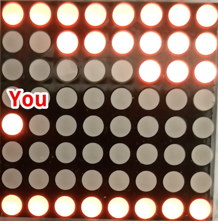
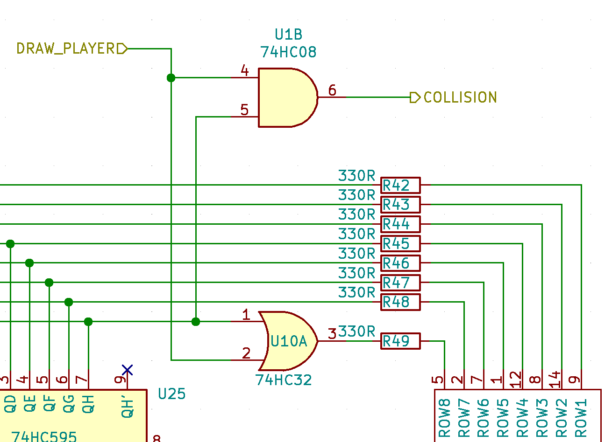
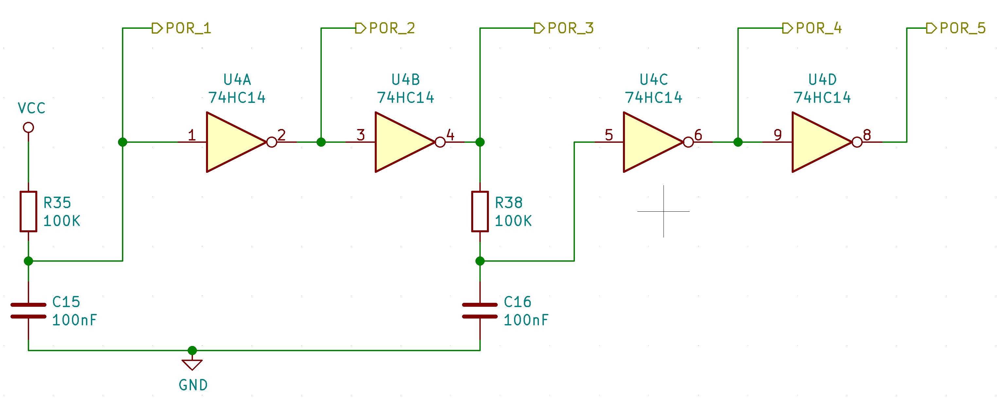

## Scramble: A Simple Scrolling Game

With the [marquee display working](../matrix/matrix.md), I figured it would be
interesting to see if it could be expanded upon with some interactive elements
to turn it into a (very simple!) game.

Could we fly and navigate a pixel through a scrolling field of obstacles in the
style of early games video?

I loved playing [River Raid](https://www.youtube.com/watch?v=pmPjsBDN9Xw) in
the mid 80s which according to [creator Carol
Shaw was inspired](http://www.vintagecomputing.com/index.php/archives/800) by
the 1981 Konami video game
[Scramble](https://en.wikipedia.org/wiki/Scramble_%28video_game%29).

With a heavy dose of imagination, a 8x8 two-color display with a single
interactive pixel for a spaceship might be a bit like the horizontally
scrolling game Scramble?

## No Microcontroller

When tinkering with the [marquee circuit](../matrix/matrix.md), I decided to
avoid using a microcontroller, Arduino or Raspberry Pi and code, but instead
hardwire everything using basic logic ICs. Even though it severely limits the
complexity we can reasonably achieve on a breadboard, it'd be a fun challenge
to continue this artificial restriction.

## Overlay Drawing 

Since the marquee circuit merely displays what's in the shift registers and
can only append to the data, not modify any pixel data already in the latches,
I decided to draw the movable pixel on top of the marquee data, on the
left-most column of the display and let you move it up an down using some
input control.

Your pixel will be at any value between 0-7 on the left-most column and to
paint it on the display, we need to wait until the row that we are on is being
drawn and then light up the last (left) pixel of the row, regardless of the
contents of the shift register at that location. When a row is painted that we
are not on, then the last pixel should just reflect the contents of the
register.

Expanding on the schematic from the [marquee circuit](../matrix/matrix.md), we
can use an OR gate to compare the value of the last bit of the shift
register and whether our pixel is located on the row currently being painted.

This also provides a convenient place for collision detection and the player to
die. If both lines are high, we have a collision, so at this point we're adding
a [74HC08](https://assets.nexperia.com/documents/data-sheet/74HC_HCT08.pdf)
(quad AND gate) and
[74HC32](https://assets.nexperia.com/documents/data-sheet/74HC_HCT32.pdf)
(quad OR gate).

## Input Control

To move the spaceship pixel up an down I decided to use a potentiometer for the
player to turn up and down, instead of push buttons, even though the analog
nature of a pot and lack of microcrontroller means more circuitry.

I decided to reuse the [custom Analog to Digital Converter](../opamp.md)
circuit I had built earlier. It uses the pot as a voltage divider and a series
of op amps to compare the voltage to 7 discrete steps. This is then encoded
into a 3 bit binary number indicating the horizontal row the player is on.

As the display scanning and refreshing logic repeatedly cycles up and down the
display, painting each line, the player's 3-bit location is compared to the
display counter. When the player's row is painted, the two 3-bit values will
match and we bring the second line to the OR gate high.

For this comparision we're using a
[74HC688](https://assets.nexperia.com/documents/data-sheet/74HC688.pdf) 8-bit
magnitude comparator (though we only use 3 of its bits).

With this in place, we now have a vertically movable pixel on top of whatever
content scrolls over the display. The circuit even detects when you run into
the environment.

## Power On Reset

When an electronic circuit that maintains state, like a
[flip-flop](https://en.wikipedia.org/wiki/Flip-flop_%28electronics%29), is
powered on, it's initial state (on or off) is generally unpredictable. This is
also the case for the storage flip-flops in our shift registers. This means
that on startup the display will be filled with random data which then
gradually scrolls off screen as new data is latched.

This was annoying with the earlier marquee circuit, but is very problematic for
our game as random data might spawn on the player's location, instantly causing
a crash.

To avoid this we need to make sure all shift registers boot up empty and since
the only way to clear a 595 shift register is to bring its `SR_CLR` line low and
then clocking its latch input `SRCLK`, we need to build a little multi-step
circuitry that runs only on startup.

Not sure how this type of thing is typically done, I decided to add a
resistor-capacitor that starts charging on startup, rising its voltage until it
triggers a
[schmitt-trigger inverter](https://assets.nexperia.com/documents/data-sheet/74HC_HCT14.pdf)
to flip, providing a digital signal delayed by about 5 milliseconds after
startup.

By daisy chaining several of these 